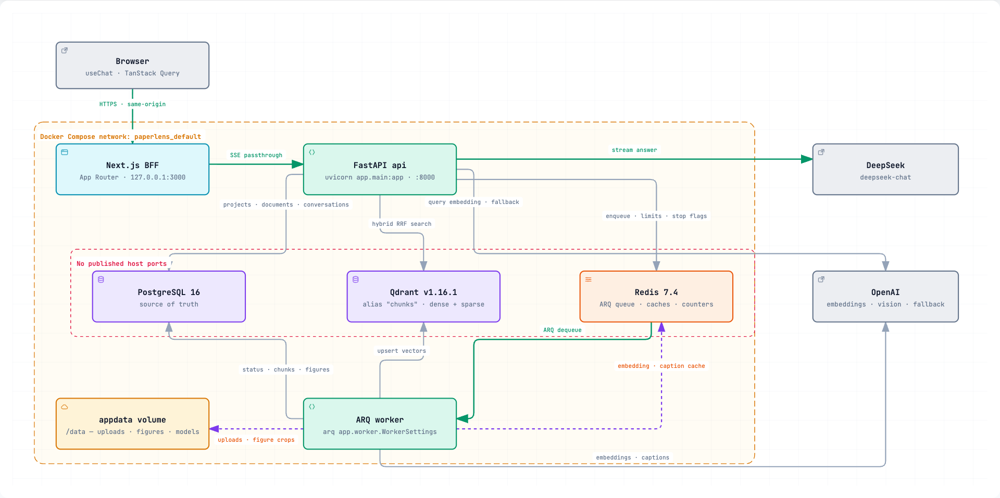

# PaperLens

> **Project-scoped, page-verifiable Q&A over your own corpus of scientific papers — built so you never have to trust the answer blindly.**

<p align="center">
  
  
  
  
  
  
  
</p>

PaperLens answers questions across a corpus of research papers **you choose**, and grounds every claim in a verbatim quote from a specific page — the exact table, the exact figure, the exact paragraph it came from. When your corpus does not contain the evidence, PaperLens **abstains** instead of inventing an answer.


---

## Table of contents

- [Screenshots](#screenshots)
- [The problem](#the-problem)
- [What makes PaperLens different](#what-makes-paperlens-different)
- [Features](#features)
- [Tech stack](#tech-stack)
- [Architecture](#architecture)
- [Getting started](#getting-started)
- [Project status & roadmap](#project-status--roadmap)
- [Design goals & target metrics](#design-goals--target-metrics)
- [License](#license)

---

## Screenshots

| Figures in answers | Original tables |
|---|---|
| Real figure crops from the source PDF, rendered inline and cited — not re-drawn by the model. | Structured tables preserved from the source document, numerics right-aligned. |
|  |  |
| **Honest abstention** | **Documents & ingestion** |
| Declines out-of-corpus questions with zero citations — no fabrication. | Live per-document ingest status across the pipeline stages, with delete & retry. |
|  |  |

Light and dark themes are both supported (persisted per browser):


> ℹ️ The screenshots above are captured from real runs. A full end-to-end
> chat capture (figure + table in one conversation, via Playwright) can be
> regenerated once the stack is running with an ingested paper — see
> [Regenerating screenshots](#regenerating-screenshots).

---

## The problem

Applied researchers and ML practitioners routinely need to extract **trustworthy numbers and conclusions from 10–30 self-selected papers** on a specific technique. The information they need usually lives in **tables and figures**, not abstracts.

Existing tools fail this job in one of two ways:

- **They destroy structure.** General chat assistants break two-column tables when parsing PDFs and silently drop figures, so the data you actually need never survives ingestion.
- **They answer without proof.** Fluent answers arrive with no way to verify a claim down to the page — so you reopen the PDF by hand to check, losing the entire speed benefit.

**Target user:** an R&D engineer / ML practitioner surveying a technique across 10–30 downloaded papers, whose job-to-be-done is *"which paper reports which number on which benchmark — and I can verify it instantly."*

## What makes PaperLens different

PaperLens is designed around a single principle: **you should not have to trust it.**

- **A — Table & figure fidelity.** Ask about data and get back the *original* table and the *original* figure crop from the source PDF — not a paraphrase, not a re-drawing. Parsing uses Docling (TableFormer) to preserve table and figure structure.
- **B — Page-verifiable citations & honest abstention.** Every claim carries an inline citation marker (`[C3]`, `[F2]`, `[T1]`) whose quote is **dereferenced verbatim from the stored chunk text** — so the quote is correct by construction, and it resolves to a specific page and section in the evidence panel. If the retrieved evidence is too weak, the app **abstains** with zero citations instead of guessing.

Everything else is deliberately scoped out of v1 to protect these two differentiators (see [Roadmap](#project-status--roadmap)).

---

## Features

Legend — **✅ Implemented** · **🟡 Partial** · **📋 Planned**

| Feature | Status | Notes |
|---------|:------:|-------|
| **PDF upload with transparent ingest status** | ✅ | Six pipeline stages (parse → crop → caption → chunk → embed → index) surfaced live in the UI with progress and human-readable errors + Retry. |
| **Project-scoped streaming Q&A** | ✅ | Token-by-token streaming over the Vercel AI SDK protocol; strict per-project isolation; cancel via a Stop endpoint (`disconnect ≠ cancel`, `asyncio.shield`). |
| **Verified citations with page & section** | ✅ | Every citation quote is a verbatim substring of the retrieved chunk; each citation ID is validated against the retrieved set during streaming; the evidence panel shows quote · section · page and a verify badge. |
| **Answers with original tables & figures** | ✅ | Tables exported structurally from the source; figures rendered from real crops — never re-generated by the model. |
| **Abstain on insufficient evidence** | ✅ | A pre-generation gate (no chunks, or top dense-cosine below the off-topic threshold) returns a fixed abstention with zero citations. |
| **Per-project conversation history** | ✅ | Conversations list, create, rename, and delete; full reload of text + citations. |
| **Document delete & re-ingest** | ✅ | Delete-by-document leaves no orphan vectors; a two-tier embedding cache (Redis, content-hash keyed) makes re-ingestion cheap. |
| **Corpus reconcile** | ✅ | A nightly job detects orphan/missing/stale vectors between Qdrant and Postgres. *(Whole-project delete is not yet wired — `delete_project` is a stub; see roadmap.)* |
| **Thumbs up/down feedback** | ✅ | Per-answer feedback persisted (`MessageFeedback`). |
| **Instant document summary card** | 🟡 | Backend stores a per-document summary and per-figure captions; a dedicated summary-card UI is still pending. |

**Deliberately out of scope for v1:** cross-paper comparison tables, authentication / multi-user, ColPali, GROBID reference parsing, semantic caching, DOI import. Each would compete for the effort behind differentiators **A + B**.

---

## Tech stack

| Layer | Technology |
|-------|------------|
| **Frontend** | Next.js `15.5.24` (App Router) · React 19 · Vercel AI SDK v7 (`ai`, `@ai-sdk/react` `useChat`) · TanStack Query 5 · Tailwind CSS 4 · Radix UI / shadcn · `react-markdown` + `remark-gfm` |
| **Backend API** | FastAPI · Uvicorn · Pydantic 2 / pydantic-settings · SSE via the AI SDK UI Message Stream wire format |
| **Background jobs** | ARQ worker on Redis 7.4 (ingestion + figure captioning + nightly reconcile) |
| **Relational DB** | PostgreSQL 16 — source of truth (chunk text, documents, conversations) · SQLAlchemy 2 (async) + Alembic |
| **Vector DB** | Qdrant `v1.16.1` — hybrid dense + sparse search, collection alias, project-scoped filters |
| **PDF parsing** | Docling 2 (TableFormer, `ACCURATE` mode) · PyMuPDF for figure crops |
| **Retrieval** | Dense: OpenAI `text-embedding-3-large` (1024-d) · Sparse: FastEmbed BM25 (server-side IDF) · Reciprocal Rank Fusion (explicit *k*) |
| **Generation** | DeepSeek `deepseek-chat` (default) → OpenAI `gpt-4o-mini` fallback via a pre-first-token circuit breaker · vision captioning on `gpt-4o-mini` |
| **Grounding check** | `rapidfuzz` partial-ratio scoring (advisory badge; the hard guarantee is verbatim quote-matching) |
| **Observability** | Structured JSON logging (`structlog`) with trace IDs · optional Langfuse tracing |
| **Reliability** | `tenacity` retry/backoff on embedding + LLM calls · per-IP rate limits · daily LLM cost cap |
| **Infra** | Docker Compose — `postgres`, `qdrant`, `redis`, `migrate`, `api`, `worker`, `frontend` |

> `backend/app/config.py` is the single source of truth for all tunable constants (chunk sizes, `rrf_k`, per-document quota, marker regex, rate limits, thresholds). Two values ship intentionally uncalibrated (`None`) until measured on real papers: `bm25_avg_len` and `offtopic_threshold` (which falls back to `0.28` at runtime).

---

## Architecture

**Modular monolith** — one backend codebase, two entrypoints (`api` + `worker`) built from the same image. The split is *interactive vs. batch*: the latency-sensitive query path stays in the API, while ingestion runs on the worker.



> An interactive version — light/dark themes, guided views for the query and ingestion paths, search, relationship tracing, and PNG/JPEG/WebP/SVG export — ships as a
> self-contained page at `docs/architecture/paperlens-architecture.html`. GitHub serves it as raw markup, so clone the repo and open the file in a browser.
> Its source of truth is the checked-in [`docs/architecture/paperlens.architecture.json`](docs/architecture/paperlens.architecture.json) specification.

- `backend/app/rag/` is an internal package shared by `api` and `worker` — **not** a separate HTTP service. Only `rag/` touches Qdrant; it never writes the `documents` table (the ARQ task owns those writes).
- A one-shot `migrate` service runs `alembic upgrade head` and gates both `api` and `worker` on `service_completed_successfully`; it is omitted from the diagram as bootstrap-only.
- A document becomes queryable as soon as its text is embedded (`TEXT_READY`); figure captioning continues in the background (`FULL_READY`).
- The intended module boundaries (e.g. "only `rag/` touches Qdrant") are documented in [`CONTRACT.md`](CONTRACT.md); machine enforcement via `import-linter` is planned, not yet wired.

### RAG pipeline

- **Parsing** (`rag/parse.py`) — Docling (TableFormer) preserves table and figure structure; a text-yield gate rejects scanned / no-text-layer PDFs honestly instead of returning garbage.
- **Chunking** (`rag/chunker.py`) — custom three-tier walk: 900 target / 1200 max tokens, 130-token overlap only at forced boundaries, greedy merge on the level-2 section path, with `[Paper][section path]` prepended to the embedded text.
- **Retrieval** (`rag/retrieval.py`) — hybrid dense + sparse prefetch (40 each), explicit-*k* Reciprocal Rank Fusion, a per-document quota (default 4) for cross-paper diversity, and a single Postgres join-back with project/quarantine/deletion guardrails.
- **Generation** (`rag/query.py`, `rag/generate.py`) — streamed Markdown with inline citation anchors validated *during* streaming; quotes dereferenced verbatim from stored chunk text; an advisory grounding badge (`grounded` / `weak`) that scores but never retracts the answer.
- **Evaluation** (`backend/eval/`) — a deterministic 16-question golden set (`golden.jsonl`) scored on recall@k, citation- and figure/table-ID validity, verbatim quote match, and abstain correctness — with four hard-gate thresholds and a non-zero exit code so it can be wired into CI.

### Why hand-wired SDKs, not a framework?

[`docs/langchain-comparison/`](docs/langchain-comparison/) contains two runnable teaching demos of the same RAG flow — one on raw SDKs (mirroring `rag/`) and one on LangChain (LCEL) — and a short rationale for why PaperLens uses direct SDKs: an explicit, tunable RRF *k*; a pre-LLM abstain gate on the raw top-1 cosine; verbatim control over the citation-marker stream; and strict module boundaries that framework abstractions tend to hide. *(Teaching material — not production code.)*

---

## Getting started

**Prerequisites:** Docker Desktop (with Compose) running, plus an OpenAI API key (embeddings + captioning) and a DeepSeek API key (default chat model).

```bash
# 1. Configure environment
cp .env.example .env        # then fill in OPENAI_API_KEY and DEEPSEEK_API_KEY

# 2. Start the stack (dev: hot-reload, infra ports bound to localhost)
docker compose up -d

# 3. Open the app
open http://localhost:3000
```

Database migrations run automatically: a one-shot `migrate` service applies `alembic upgrade head`, and both `api` and `worker` wait for it to complete before starting.

**Production-style bring-up** (no dev override, no infra host ports):

```bash
docker compose -f docker-compose.yml up
```

> **Security note (v1):** PaperLens ships **without authentication** and is intended for **localhost-only** deployment. In the base compose file only `api` (`127.0.0.1:8000`) and `frontend` (`127.0.0.1:3000`) publish ports; Postgres, Qdrant, and Redis are never exposed outside the Compose network. A configurable **daily LLM cost cap** (`DAILY_COST_CAP_USD`, default `$5`) and per-IP rate limits protect your credits.

### Configuration

Grouped keys in `.env.example`:

| Group | Keys |
|-------|------|
| Infrastructure | `DATABASE_URL`, `REDIS_URL`, `QDRANT_URL`, `QDRANT_COLLECTION_ALIAS` |
| Storage | `DATA_DIR`, `HF_HOME` (Docling / HF model cache) |
| LLM & embeddings | `OPENAI_API_KEY`, `DEEPSEEK_API_KEY`, `DEEPSEEK_BASE_URL`, `LLM_MODEL_DEFAULT`, `LLM_MODEL_FALLBACK` |
| Observability *(optional)* | `LANGFUSE_PUBLIC_KEY`, `LANGFUSE_SECRET_KEY`, `LANGFUSE_HOST` |
| Limits *(defaults in `config.py`)* | `RATE_LIMIT_MESSAGES`, `RATE_LIMIT_UPLOADS`, `DAILY_COST_CAP_USD` |

### Regenerating screenshots

The end-to-end chat capture is reproducible once the stack is up **and** a paper has been ingested into a project (ingestion spends real API credits for embeddings, figure captioning, and generation). With that in place, a Playwright session can drive a figure + table question and save the result to `docs/images/`.

---

## Project status & roadmap

PaperLens is in **active development**. The table below reflects what is in the repository today, not a forward plan stated as fact.

Legend — **✅ Shipped** · **🟡 Partial** · **📋 Planned**

| Phase | Scope | Status |
|-------|-------|:------:|
| **P0** | Skeleton + contracts: docker-compose, DB schema & `DocumentStatus` state machine, structured logging, streaming protocol | ✅ |
| **P1** | Ingestion: Docling parsing, figure crop + caption, chunker, embedding with two-tier cache, Qdrant setup | ✅ |
| **P2** | Chat: hybrid RRF retrieval, AI SDK protocol end-to-end, cancel/abort, deterministic eval harness | 🟡 — harness exists; **CI wiring and Langfuse are not yet enabled** |
| **P3** | Figures + citations: incremental stream parser for citation anchors, inline ID validation, grounding checks, evidence panel | ✅ |
| **P4** | Hardening: per-IP rate limiting + daily cost cap ✅, reconcile cron ✅; backup/restore drill & nightly RAGAS regression 📋 | 🟡 |

**Known gaps (tracked, not hidden):**

- Whole-project deletion (`delete_project`) is a stub — document-level delete and reconcile are the current path.
- "Open PDF at page N" deep-links in the evidence panel are present but disabled (no embedded PDF viewer yet); the panel resolves the exact page, section, and verbatim quote today.
- `import-linter` is a dependency but has no contracts wired; module boundaries are enforced by convention/review.
- Should-have items — in-project full-text search, export-to-Markdown, suggested questions — are not yet implemented.

---

## Design goals & target metrics

These are **engineering targets from the design spec**, not measured results. They define the bar PaperLens is built to hit; the eval harness and instrumentation exist to measure against them, but no benchmark run is committed to this repository yet.

| Dimension | Target |
|-----------|--------|
| Time-to-first-answer (upload → first answer) | p50 ≤ 2 min |
| TTFT (first text delta) | p95 ≤ 2.5 s |
| Citation quote-match | verbatim (`== 1.0`) — enforced by construction |
| Abstain correctness on out-of-corpus questions | ≥ 90 % |
| Cancel latency (Stop → LLM call halts) | ≤ 500 ms |
| Ingestion (40-page PDF → `TEXT_READY`) | ≤ 90 s |
| Embedding cache hit rate on re-ingest | ≥ 80 % |

The verbatim-quote guarantee is the one item on this list that holds **by construction** rather than by measurement: citation quotes are dereferenced directly from stored chunk text, so a returned quote is always an exact substring of its source chunk.

---

## License

TBD.
