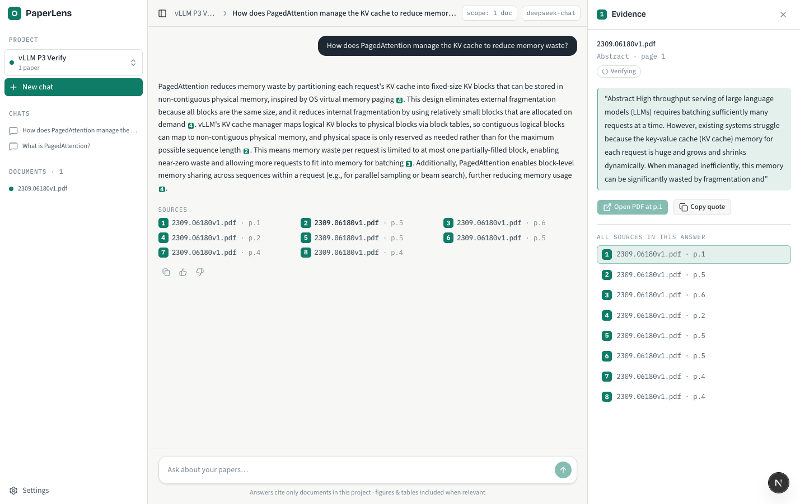
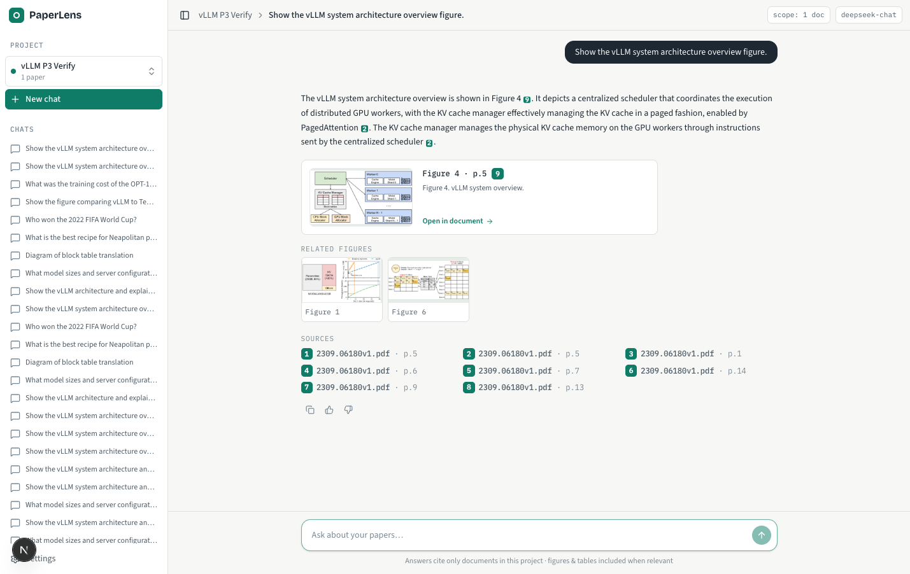
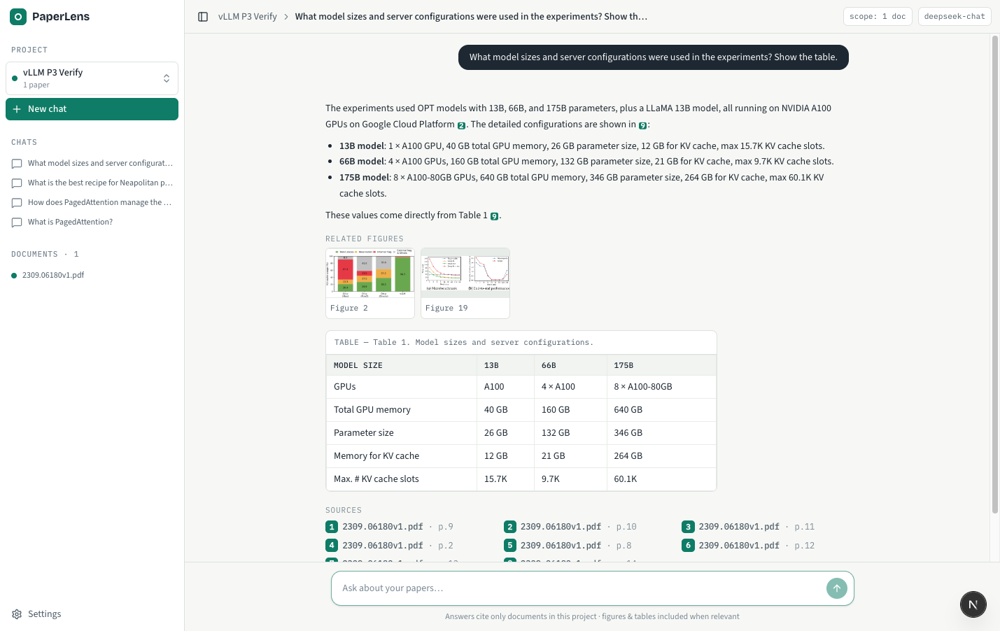
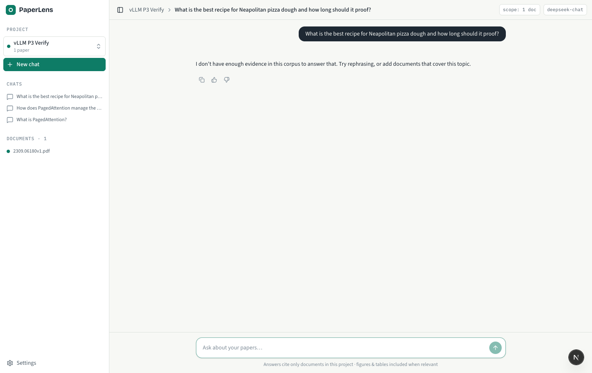
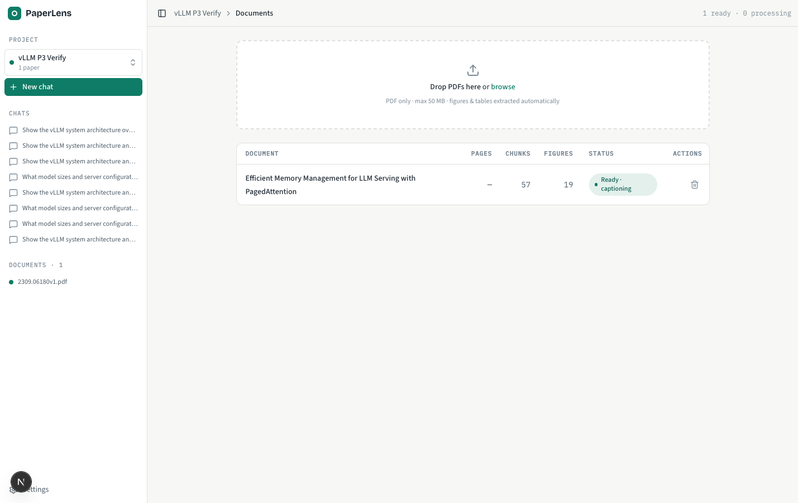
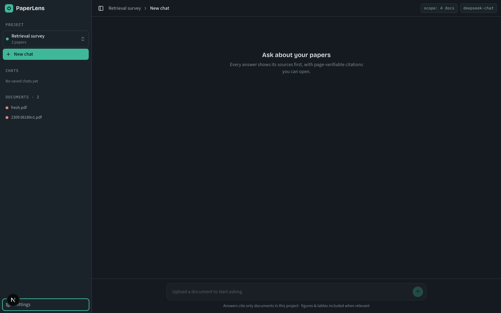

# PaperLens

**Ask questions across your own corpus of scientific papers — and never have to trust the answer blindly.**

PaperLens is a project-scoped question-answering system for research papers. Every number in an answer points back to the exact table, the exact figure, and the exact page it came from. When there isn't enough evidence in your corpus, PaperLens says so instead of making something up.



## Project Context

Applied researchers and ML practitioners routinely need to extract **trustworthy numbers and conclusions from 10–30 self-selected papers** about a specific technique. The information they need usually lives in **tables and figures**, not abstracts. Existing tools either destroy table/figure structure when parsing PDFs, or answer fluently without any way to verify the claim down to the page — forcing users to reopen the PDF manually and losing the entire speed benefit.

**Target persona:** an R&D engineer / ML practitioner surveying a technique across 10–30 downloaded papers, whose job-to-be-done is *"which paper reports which number on which benchmark — and I can verify it instantly."*

### Positioning

PaperLens is designed so that **you don't have to trust it**:

- **A — Table & figure fidelity.** Ask about data — get back the *original* table and the *original* figure, not a paraphrase. (Where ChatGPT breaks two-column tables and NotebookLM drops figures.)
- **B — Page-verifiable citations.** Every claim carries an inline citation `[n]` that opens the exact page in the PDF viewer. If the evidence isn't in your corpus, the app **abstains** instead of guessing.

## Screenshots

| Figures in answers | Original tables |
|---|---|
| Real figure crops rendered inline and cited — not re-drawn by the model. | Structured tables preserved from the source, right-aligned numerics. |
|  |  |
| **Honest abstention** | **Documents & ingestion** |
| Declines out-of-corpus questions with zero citations — no fabrication. | Live ingest status, per-document delete & retry. |
|  |  |

Light and dark themes are both supported:



## Features

### Core (v1)

| # | Feature | Highlights |
|---|---------|-----------|
| M1 | **Project CRUD** | Deleting a project leaves zero orphan vectors, files, or rows (verified by a reconcile script) |
| M2 | **PDF upload with transparent ingest status** | 6 pipeline stages with progress % and real ETA; a 40-page PDF reaches `text_ready` in ≤ 90 s; human-readable errors with Retry |
| M3 | **Project-scoped streaming Q&A** | TTFT p95 ≤ 2.5 s; strict project isolation; cancel stops the LLM call in ≤ 500 ms |
| M4 | **Verified citations with page links** | ≥ 95 % of citations pass fuzzy quote-matching; every citation ID belongs to the retrieved set; click opens the exact page |
| M5 | **Answers with original tables & figures** | Rendered from the source document, not re-generated by the model |
| M6 | **Abstain on insufficient evidence** | ≥ 90 % abstain rate on out-of-corpus questions, zero fabricated numbers |
| M7 | **Per-project conversation history** | Full reload of text + citations; deleted sources degrade gracefully |
| M8 | **Delete / re-ingest documents** | No orphan vectors; embedding cache gives ≥ 80 % hits on re-ingest |
| M9 | **Instant document summary card** | 5-line summary + list of tables/figures, shown ≤ 5 s after `text_ready` — you can start reading while figures are still being captioned |

### Should have

- Full-text search within a project (Postgres `tsvector`) as an escape hatch when retrieval misses
- Export answers to Markdown with citations
- Suggested questions per project (fights the cold-start problem)
- Thumbs up/down feedback on answers

### Explicitly out of scope (v1)

Cross-paper comparison tables, auth/multi-user, ColPali, GROBID reference parsing, semantic caching, DOI import — each would eat into the effort behind differentiators A + B.

## Architecture

**Modular monolith**: one backend codebase, two entrypoints (`api` + `worker`) built from the same image. The cut is *interactive vs. batch* — the query path stays in the API (latency-sensitive), while ingestion runs on the worker.

```
Browser (useChat) ──▶ Next.js BFF ──SSE──▶ FastAPI api ──▶ Postgres (source of truth)
                                              │   └──────▶ Qdrant  (hybrid RRF retrieval)
                                              ▼
                                        Redis · ARQ queue
                                              │
                                              ▼
                                         ARQ worker ──▶ parse → crop → caption → chunk → embed → upsert
                                              └────────▶ Volume (uploads/ · figures/ · models/)
```

- `rag/` is an internal package shared by `api` and `worker` — not a separate HTTP service. Only `rag/` touches Qdrant.
- Module boundaries are enforced in CI with `import-linter`.
- Documents become queryable as soon as text is embedded (`text_ready`); figure captioning continues in the background (`full_ready`).

### RAG pipeline

- **Parsing:** Docling (TableFormer) preserves table and figure structure; text-yield gate rejects scanned PDFs honestly instead of returning garbage
- **Chunking:** 900 target / 1200 max tokens, 130 overlap, hard boundaries at level-2 headings, `[Paper][Section path]` prepended to embedded text
- **Retrieval:** hybrid dense + sparse with Reciprocal Rank Fusion, per-document quota (default 4) for cross-paper diversity, gated query rewriting for multi-turn follow-ups
- **Generation:** streamed Markdown with inline citation anchors (`[C3]` / `[F2]`), inline ID validation during streaming, plus an async grounding check that scores (never retracts) answers
- **Evaluation:** 25-question golden set with 6 deterministic code metrics as a hard CI gate; RAGAS nightly with a McNemar paired test

## Tech Stack

| Layer | Technology |
|-------|------------|
| Frontend | **Next.js 15**, Vercel AI SDK (`useChat`, SSE data parts), TanStack Query |
| Backend API | **FastAPI** (Python), SSE streaming via AI SDK wire protocol |
| Background jobs | **ARQ** worker on **Redis** |
| Relational DB | **PostgreSQL** (source of truth, chunk text, conversations), SQLAlchemy + Alembic |
| Vector DB | **Qdrant** (hybrid search, collection aliases, payload indexes) |
| PDF parsing | **Docling** (TableFormer for tables, figure cropping) |
| LLM | **DeepSeek** (default) with **OpenAI** fallback via circuit breaker |
| Embeddings | OpenAI `text-embedding-3-large` |
| Observability | Structured logging from day one; **Langfuse Cloud** tracing |
| Infra | **Docker Compose** (api, worker, migrate, Postgres, Qdrant, Redis, frontend) |

## Getting Started

```bash
# 1. Configure environment
cp .env.example .env        # then fill in your API keys

# 2. Start the stack
docker compose up -d

# 3. Open the app
open http://localhost:3000
```

> **Security note:** v1 ships without authentication. Deploy **localhost-only** (services bind `127.0.0.1`); infrastructure ports (Postgres, Qdrant, Redis) are never exposed outside the Compose network. A hard daily cost cap protects your LLM credits.

## Roadmap

| Phase | Duration | Scope |
|-------|----------|-------|
| **P0** | ~1 week | Skeleton + contracts: docker-compose, DB schema & `DocumentStatus` state machine, fake SSE endpoint so the frontend can build in parallel, structured logging |
| **P1** | ~2 weeks | Ingestion: Docling parsing, figure crop + caption, chunker, embedding with 2-tier cache, Qdrant setup, real cost measurement on sample papers |
| **P2** | ~2 weeks | Chat: hybrid RRF retrieval, AI SDK protocol end-to-end, query rewriting & multi-turn, cancel/abort, Langfuse, **Tier-0 eval as a hard CI gate** |
| **P3** | ~2–3 weeks | Figures + citations (the hardest 30 %): incremental stream parser for citation anchors, inline ID validation, grounding checks, evidence panel |
| **P4** | ~1.5 weeks | Hardening: rate limiting + daily cost cap, reconcile cron, RAGAS nightly, backup/restore drill |

## Success Metrics (v1)

- Time-to-first-answer (upload → first answer): **p50 ≤ 2 min**
- Citation quote-match pass rate: **≥ 95 %**
- Numeric answer accuracy (golden set): **≥ 85 %**
- Correct-figure rate: **≥ 80 %**
- Abstain precision: **≥ 90 %** recall out-of-corpus, ≤ 10 % false abstains
- TTFT (first text delta): **p95 ≤ 2.5 s**

## License

TBD
